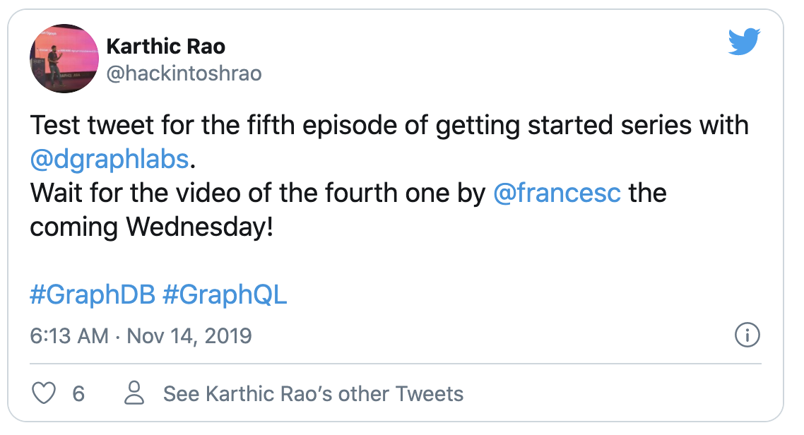

# 欢迎观看使用Dgraph入门的第五篇教程。

在上篇一教程中，我们学习了如何使用多语言字符串以及如何使用语言标签对其进行操作。

在本教程中，我们将在Dgraph中对Twitter进行建模，并使用它来学习有关Dgraph中的字符串索引相关的更多知识。

我们将专门了解下面这些：

- 在Dgraph中建模Twitter。
- 在Dgraph中使用字符串索引
  - 使用哈希索引查询Twitter用户。
  - 使用精确(exact)索引比较字符串。
  - 使用term索引根据关键字搜索推文。

[这是此博客文章的免费视频，依然是Youtube的](https://youtu.be/Ww5cwixwkHo)


让我们开始分析真实的Twitter的结构，并弄清楚如何在Dgraph中对其进行建模。

在Dgraph中建模Twitter
这是示例推文。


让我们分析一下上面的推文。这是Twitter的组成部分：

- 作者   
该推文的作者是用户@hackintoshrao。

- Twitter Body   
该组件是Twitter的内容。

`Test tweet for the fifth episode of getting started series with @dgraphlabs. Wait for the video of the fourth one by @francesc the coming Wednesday! #GraphDB #GraphQL`

- 主题标签   
这是Twitter中的主题标签：#GraphQL和#GraphDB。

- 提及   
一条推文可以提及其他Twitter用户。

以下是上述推文中的提及：@dgraphlabs和@francesc。

在使用这些组件在Dgraph中对Twitter进行建模之前，让我们回顾一下图模型的设计原理：

`节点和边是图模型的构建基础。可能是销售，Twitter，用户信息，任何概念或实体都被表示为节点。如果有两个节点的关系，请在它们之间创建一条边来表示。`

牢记以上设计原则，让我们看一下tweet的各个组成部分，看看如何将它们放入Dgraph。

- 作者 Author  

推文的作者是推特用户。我们应该使用一个节点来表示这一点。

- 正文 Body   

我们应该将每条推文都表示为一个节点。

- 主题标签 Hashtags   

将主题标签表示为成节点是有利的。它为我们提供了更好的查询灵活性。

尽管您可以从推文正文中搜索主题标签，但这样做并没有效率。创建唯一的节点来表示＃标签，可以让您编写如下的高性能查询：嘿Dgraph，给我所有带有#graphql的推文

- 提及 Mentions

提及代表Twitter用户，我们已经将用户建模为节点。因此，我们将提及表示为一条推文与提及的用户之间的边。

## 关系
我们有三种类型的节点：User，Tweet和Hashtag。


让我们看看这些节点之间可能如何相互关联，并将它们之间的关系建模为它们之间的一条边。

### 用户和推文节点

Tweet和U​​ser节点之间存在双向关系。

 - 每个推文都是由用户创作的，用户可以创作许多推文。
让我们将代表这种关系的边命名为authored。

authored边是从“用户”节点指向“推文”节点。

 - 一个推文可以提及许多用户，并且可以在许多推文中提及用户。
让我们命名上述关系的边为 mentioned。

mentioned的边从Tweet节点指向User节点。这些用户是推文中mentioned的用户。


### tweet和主题标签节点(hashtag)

一条推文可以包含一个或多个主题标签(hashtag)。我们将边命名为“ tagged_with”，以表示这种关系。

一个tagged_with边从一条Tweet节点指向一个Hashtag节点。这些主题标签节点(hashtag)对应于推文中的主题标签。


### 作者和主题标签节点

作者和主题标签节点之间没有直接关系。因此，我们不需要它们之间的直接的关系。

我们的Twitter图模型已准备就绪！就是这样的


这是我们的样本Twitter的图。


让我们在列表中添加几条推文。


我们将使用这两个推文和最上面的示例推文，作为数据集使用的。打开Ratel，转到mutate选项卡，粘贴突变操作，然后单击Run。
```
{
  "set": [
    {
      "user_handle": "hackintoshrao",
      "user_name": "Karthic Rao",
      "uid": "_:hackintoshrao",
      "authored": [
        {
          "tweet": "Test tweet for the fifth episode of getting started series with @dgraphlabs. Wait for the video of the fourth one by @francesc the coming Wednesday!\n#GraphDB #GraphQL",
          "tagged_with": [
            {
              "uid": "_:graphql",
              "hashtag": "GraphQL"
            },
            {
              "uid": "_:graphdb",
              "hashtag": "GraphDB"
            }
          ],
          "mentioned": [
            {
              "uid": "_:francesc"
            },
            {
              "uid": "_:dgraphlabs"
            }
          ]
        }
      ]
    },
    {
      "user_handle": "francesc",
      "user_name": "Francesc Campoy",
      "uid": "_:francesc",
      "authored": [
        {
          "tweet": "So many good talks at #graphqlconf, next year I'll make sure to be *at least* in the audience!\nAlso huge thanks to the live tweeting by @dgraphlabs for alleviating the FOMO😊\n#GraphDB ♥️ #GraphQL",
          "tagged_with": [
            {
              "uid": "_:graphql"
            },
            {
              "uid": "_:graphdb"
            },
            {
              "hashtag": "graphqlconf"
            }
          ],
          "mentioned": [
            {
              "uid": "_:dgraphlabs"
            }
          ]
        }
      ]
    },
    {
      "user_handle": "dgraphlabs",
      "user_name": "Dgraph Labs",
      "uid": "_:dgraphlabs",
      "authored": [
        {
          "tweet": "Let's Go and catch @francesc at @Gopherpalooza today, as he scans into Go source code by building its Graph in Dgraph!\nBe there, as he Goes through analyzing Go source code, using a Go program, that stores data in the GraphDB built in Go!\n#golang #GraphDB #Databases #Dgraph ",
          "tagged_with": [
            {
              "hashtag": "golang"
            },
            {
              "uid": "_:graphdb"
            },
            {
              "hashtag": "Databases"
            },
            {
              "hashtag": "Dgraph"
            }
          ],
          "mentioned": [
            {
              "uid": "_:francesc"
            },
            {
              "uid": "_:dgraphlabs"
            }
          ]
        },
        {
          "uid": "_:gopherpalooza",
          "user_handle": "gopherpalooza",
          "user_name": "Gopherpalooza"
        }
      ]
    }
  ]
}
```
`注意：如果您是Dgraph的新手，但仍然想弄清楚如何运行数据库和使用Ratel，我们强烈建议您阅读本系列的前面的文章`

这是我们构建的图。


我们的图有这些内容：

- 五个蓝色的twitter用户节点。
- 绿色节点是推文。
- 蓝色的是主题标签hashtags。

我们先通过查询数据库中的twitter用户来开始我们的tweet吧。
```
{
  tweet_graph(func: has(user_handle)) {
     user_handle
  }
}
```

`注意：如果您对上面的查询语法不太熟悉，请查看前面的教程。`

现在 我们有四个Twitter用户：@hackintoshrao，@francesc，@dgraphlabs和@gopherpalooza。

现在，我们也能找到他们的推文和主题标签。
```
{
  tweet_graph(func: has(user_handle)) {
     user_name
     authored {
      tweet
      tagged_with {
        hashtag
      }
    }
  }
}
```


`注意：如果您不熟悉上述查询中的遍历查询语法，请查看该系列的第三篇教程。`

在开始查询图之前，让我们使用一个简单的类比来学习一些有关数据库索引的知识。

## 什么是索引？
索引是一种通过最小化查询处理时所需的磁盘访问次数来优化数据库性能的方法。

考虑一本600页的“书”，分为30个部分。假设每个部分的页面数不同。

现在，没有索引页，要查找以字母“F”开头的特定部分，除了浏览整本书，别无选择。即：600页。

但是开头有一个索引页，因此可以更轻松地访问预期的信息。您只需要查看索引页面，找到匹配的索引后，可以通过跳过其他部分来有效地跳到该部分。

但是请记住，索引页也会占用磁盘空间！仅在必要时使用它们。

在我们的下一部分中，让我们在Twitter图上学习一些有趣的查询吧。

## 字符串索引和查询
### 哈希索引
让我们编写一个查询，说：嘿Dgraph，找到Twitter用户等于hackintoshrao的推文。

在此之前，我们需要首先在user_handle谓词上添加一个索引。我们知道字符串索引有5种类型：Hahs，exact，term，full-text和trigram。

所使用的字符串索引的类型取决于要在字符串谓词上运行的查询的类型。

在现在这种情况下，我们要基于谓词的确切字符串值去搜索节点。对于这样的用例，建议使用哈希索引(hash)。

首先，将哈希索引添加到user_handle谓词中。


现在，让我们使用eq比较去查找hackintoshrao的所有推文。

转到查询选项卡，键入查询，然后单击运行。
```
 {
  tweet_graph(func: eq(user_handle, "hackintoshrao")) {
     user_name
     authored {
		tweet
    }
  }
}
```


`注意：如果您想详细了解比较函数的功能（例如eq），请参阅第三个教程。`

让我们扩展最后一个查询，以获取主题标签和mentions。
```
{
  tweet_graph(func: eq(user_handle, "hackintoshrao")) {
     user_name
     authored {
      tweet
      tagged_with {
        hashtag
      }
      mentioned {
        user_name
      }
    }
  }
}
```


您是否知道Dgraph中的字符串的值也可以使用大于或小于等比较器进行比较？

在下一节中，让我们看看如何对字符串类型的谓词使用等于（eq）之外的比较函数。

## 精确指数(Exact Index)
我们在第三篇教程中讨论了Dgraph中有五个比较函数。

快速回顾一下：
|比较函数名|功能|
| -- | -- |
| eq | 等于 |
| lt | 小于 |
| le | 小于等于 |
| gt | 大于 |
| ge | 大于等于 |
所有五个比较函数都可以应用于字符串谓词。

我们已经使用了eq。 其他四个对于操作非常有用，这取决于字符串的字母顺序。

让我们通过一个简单的示例来了解它。

让我们找到按字母顺序排列在dgraphlabs之后的twitter帐户。
```
{
  using_greater_than(func: gt(user_handle, "dgraphlabs")) {
    user_handle
  }
}
```


糟糕，我们又发生了错误！

您会从错误中看到，user_handle谓词上的哈希索引不支持gt函数。

为了能够进行上述字符串比较操作，您需要首先在字符串谓词上设置exact类型的索引。

exact的索引是唯一允许您在字符串谓词上使用ge，gt，le，lt比较器的字符串索引。

提醒您exact的索引还允许您使用等于（eq）比较。但是，如果您只想在字符串谓词上使用equals（eq）比较器，则使用exact索引就是用力过猛了。hash索引将是一个更好的选择，因为它通常更节省。

让我们看看实际的索引。


我们又有一个错误！

尽管一个字符串谓词可以具有多个索引，但是其中一些是互不兼容。这样的例子之一是hash和exact索引的组合。

user_handle谓词已经具有哈希索引，因此尝试设置exact的索引会给您带来错误。

让我们取消选中user_handle谓词的hash索引，选择exact的索引，然后单击更新。


尽管Dgraph允许您更改谓词的索引类型，但仅在必要时才进行更改。更改索引后，需要重新索引数据，这需要一定的计算，因此可能需要花一些时间。重新进行索引操作运行时，所有突变都会被保留，不用担心数据丢失问题。

现在，让我们重新运行查询。


结果包含三个Twitter handles：francesc，gopherpalooza和hackintoshrao。

按字母顺序排序，这些twitter 的Handler是大于dgraphlabs。

有些推文对我们的吸引力比另一些更好。例如，我喜欢Graphs和Go。因此，我一定会喜欢与这些主题相关的推文。所以基于关键字的搜索是查找相关信息的有用方法。

我们可以根据与您的兴趣相关的一个或多个关键字来搜索推文吗？

肯定可以啊！让我们在下一部分中进行操作。

## Term索引
术语(Term)索引使您可以基于一个或多个关键字来搜索字符串谓词。这些关键字称为术语(Term)。

为了能够使用特定的关键字或术语搜索推文，我们需要首先在推文上设置术语索引。

添加术语(Term)索引类似于添加任何其他字符串索引。


Dgraph提供了两个专门用于搜索术语的内置函数：allofterms和anyofterms。

除了这两个功能，术语索引仅支持eq比较。这意味着，当对带有术语索引的字符串谓词运行时，任何其他查询函数（例如eq，lt，gt…）都会失败。

我们将很快查看包含字符串索引及其支持的查询功能的表。但首先，让我们学习如何使用anyofterms和allofterms查询功能。让我们写一个查询来查找所有带有术语或关键词“ Go”或“ Graph”的推文。

转到查询选项卡，粘贴查询，然后单击运行。
```
{
  find_tweets(func: anyofterms(tweet, "Go Graph")) {
    tweet
  }
}
```
下面就是匹配的结果
```
{
        "tweet": "Let's Go and catch @francesc at @Gopherpalooza today, as he scans into Go source code by building its Graph in Dgraph!\nBe there, as he Goes through analyzing Go source code, using a Go program, that stores data in the GraphDB built in Go!\n#golang #GraphDB #Databases #Dgraph "
}
```


anyofterms函数返回带有Go或Graph关键字的推文。

刚才，我们仅使用两个词来搜索（Go和Graph），但是您可以扩展匹配任何数量的词。

上面的结果是我们的数据库中三个推文中的一个。 其他两条推文未进入搜索结果，因为它们没有术语“Go”或“Graph”。

同样需要注意的是，术语搜索功能（anyofterms和allofterms）对大小写和特殊字符不敏感。

这意味着，如果您搜索术语GraphQL，则查询将在推文中找到的以下所有术语的匹配：graphql，graphQL，＃graphql，＃GraphQL。

现在，让我们查找一下其中包含Go或GraphQL术语的推文。
```
{
  find_tweets(func: anyofterms(tweet, "Go GraphQL")) {
    tweet
  }
}
```


哦，哇，我们在结果中包含了所有三个推文。 这意味着，所有三个推文均具有术语Go或GraphQL。

现在，如何查找同时包含术语Go和GraphQL的推文。 我们可以使用allofterms函数来做到这一点。
```
{
  find_tweets(func: allofterms(tweet, "Go GraphQL")) {
    tweet
  }
}
```


我们没有得到任何结果。 这些推文中都没有同时包含Go与GraphQL这两个词。

除了Go和Graph外，我还是GraphQL和GraphDB的忠实拥护者。

让我们再试下找出包含关键字GraphQL和GraphDB的推文。


结果中有两条推文，它们都有GraphQL和GraphDB术语。
```
{
  "tweet": "Test tweet for the fifth episode of getting started series with @dgraphlabs. Wait for the video of the fourth one by @francesc the coming Wednesday!\n#GraphDB #GraphQL"
},
{
  "tweet": "So many good talks at #graphqlconf, next year I'll make sure to be *at least* in the audience!\nAlso huge thanks to the live tweeting by @dgraphlabs for alleviating the FOMO😊\n#GraphDB ♥️ #GraphQL"
}
```
在总结前，我们总结个表吧。
|Index类型|可用的比较函数|
|--|--|
|hash|eq|
|exact|eq,lt,gt,le,ge|
|term|eq,allofterms,anyofterms|

## 总结
在本教程中，我们对一系列推文进行了建模，并设置了exact索引，术语(term)索引和哈希(hash)索引以进行查询。

您是否知道Dgraph还提供了更强大的搜索功能，例如全文搜索和基于正则表达式的搜索？

在下一个教程中，我们将探索这些功能并了解搜索您喜欢的推文的更强大的方法！

听起来不错吧？
